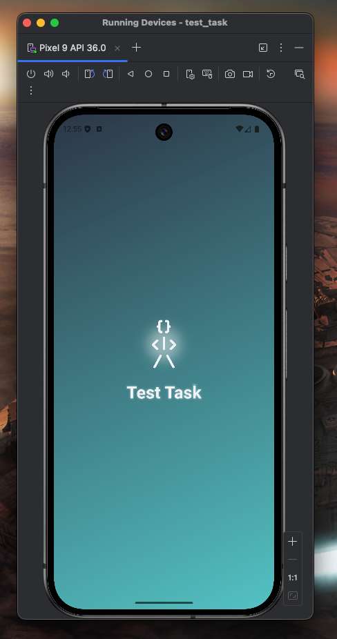
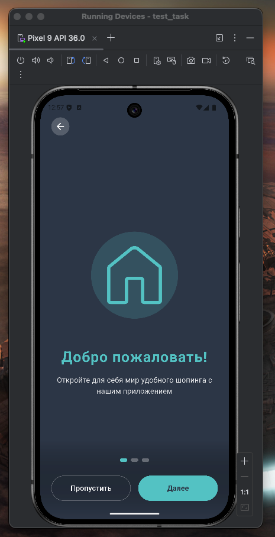
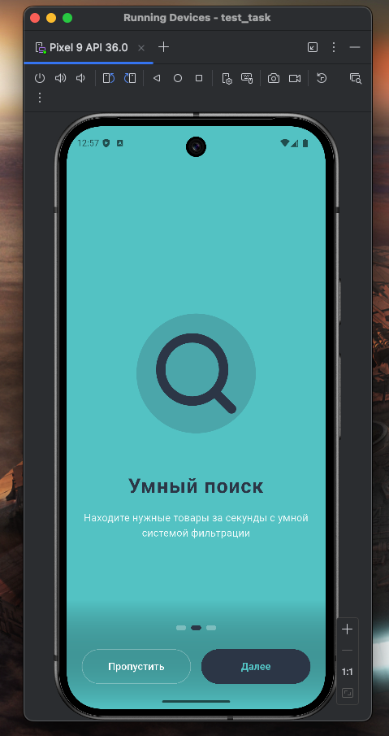
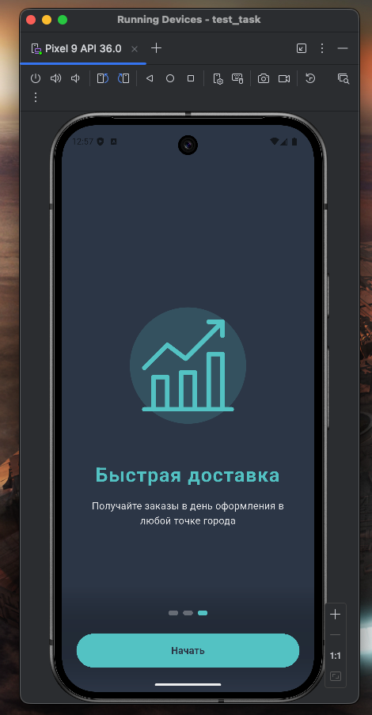
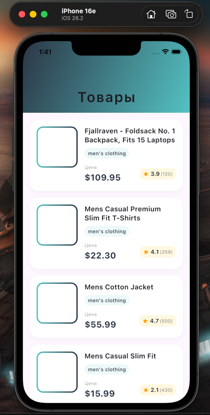

# Test Task - Flutter Mobile Application
Мобильное приложение на Flutter, разработанное в качестве тестового задания. Приложение включает в себя экран загрузки, онбординг и бесконечную ленту товаров с подгрузкой данных из FakeStoreAPI.

## Содержание
- [Описание проекта](#описание-проекта)
- [Функциональность](#функциональность)
- [Технологии](#технологии)
- [Архитектура](#архитектура)
- [Установка и запуск](#установка-и-запуск)
- [Скриншоты](#скриншоты)

## Описание проекта

Тестовое мобильное приложение, демонстрирующее навыки разработки на Flutter с использованием чистой архитектуры (Clean Architecture) и паттерна MVVM. Приложение загружает товары с открытого API FakeStoreAPI и представляет их в виде бесконечной ленты с возможностью подгрузки при прокрутке.

### Основные требования, реализованные в проекте:
- Качество кода
- Архитектура проекта
- Анимации 
- Cетевые запросы
- Бесконечный скролл


## Функциональность

### 1. Splash Screen (Экран загрузки)
- Анимированный логотип с появлением
- Градиентный фон
- Автоматический переход после загрузки
- Проверка статуса онбординга

### 2. Onboarding (Экран приветствия)
- 3 информационные страницы
- Плавные анимации появления элементов
- Индикатор текущей страницы
- Кнопки "Пропустить" и "Далее"/"Начать"
- Сохранение статуса просмотра (показывается только 1 раз)

### 3. Feed (Лента товаров)
- Бесконечная лента с подгрузкой товаров
- Shimmer-эффект при загрузке
- Анимированное появление карточек товаров
- Обработка ошибок сети
- Pull-to-refresh (обновление списка)
- Детальная информация о товаре (изображение, название, цена, рейтинг)

## Технологии

- **Flutter** - основной фреймворк
- **Dart** - язык программирования
- **Provider** - управление состоянием (MVVM)
- **Dio** - HTTP клиент для API запросов
- **SharedPreferences** - хранение локальных данных
- **smooth_page_indicator** - индикатор страниц онбординга
- **flutter_svg** - работа с SVG иконками
- **shimmer** - эффект загрузки

## Архитектура

Проект построен с использованием **Clean Architecture** и **MVVM** паттерна

## Установка и запуск

### Предварительные требования

- Установленный Flutter SDK (версия 3.0.0 или выше)
- Установленный Dart SDK (версия 3.0.0 или выше)
- Android Studio / Xcode для эмулятора или физическое устройство

### Пошаговая инструкция

1. **Клонируйте репозиторий**
   ```bash
   git clone https://github.com/MKudryash/TestTaskFlutterITECO
   cd test_task
2. Установите зависимости
    ```bash
    flutter pub get
3. Запустите приложение  
   ```bash
   # Для отладки
   flutter run
   # Для сборки APK (Android)
   flutter build apk --release
   # Для сборки IPA (iOS)
   flutter build ios --release

# Скриншоты

Splash Screen
<div align="center">  <p><em>Экран загрузки с анимированным логотипом</em></p> </div>
Onboarding Screens
<div align="center"> <table> <tr> <td></td> <td></td> <td></td> </tr> </table> <p><em>Страницы онбординга с анимациями</em></p> </div>
Feed Screen
<div align="center"> <table> <tr> <td></td> </tr> </table> <p><em>Лента товаров (плохо загружает фото из-за интернета)</em></p> </div>        

